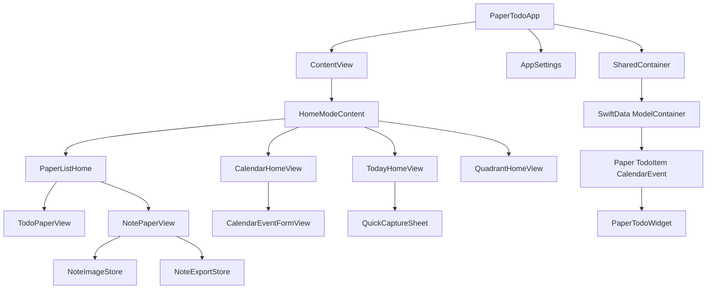

# 系统架构

## 应用结构

## 应用层

`PaperTodoApp` 创建 SwiftData 容器、注入 `AppSettings`，启动时初始化示例日历数据，并在后台清理孤立图片。`ContentView` 管理首页模式、纸片查询、筛选、导航、删除延迟和撤销状态。

## 展示层

- `HomeModeContent` 根据 `HomeMode` 切换今日、纸片、日历和四象限。
- `TodayHomeView` 聚合当天的未完成待办、日历事件和完成进度。
- `QuickCaptureSheet` 将输入保存为收件箱任务或新笔记纸片。
- `TodoPaperView` 管理待办排序、完成、删除、拖放、撤销/重做、自动清除和 Widget 刷新。
- `NotePaperView` 管理 Markdown 编辑、预览、图片导入、导出和标题。
- `CalendarHomeView` 管理月份网格、日期选择、彩色事件标签、周标尺和日时间线。
- `QuadrantHomeView` 从 `TodoItem` 派生四象限任务并提供移动、编辑、完成和打开纸片。
- `SettingsView` 管理外观、配色、待办字号、自动清除和 Markdown 渲染强度。

## 数据和共享资源

`SharedContainer` 使用 App Group `group.com.papertodo` 保存 SwiftData store。`Paper` 通过级联关系拥有 `TodoItem`；`CalendarEvent` 独立保存事件。图片保存在 Documents 下的 `note-assets` 目录，`NoteImageStore` 负责合法文件名、缓存、导入、导出复制和引用清理。

## Widget

`PaperTodoWidget` 使用同一个 App Group 容器读取所有 `TodoItem`，生成待办数、完成数和进度。应用侧在关键待办变化后调用 `WidgetCenter.shared.reloadAllTimelines()`。

## 主要数据流

1. `PaperTodoApp` 创建并注入共享 ModelContainer。
2. `ContentView` 通过 `@Query` 读取纸片并按模式分发。
3. 子页面直接通过 `@Bindable` 修改模型，并使用 `modelContext.save()` 持久化。
4. Widget 通过相同 App Group store 读取待办汇总。
5. 图片正文引用经过 `NoteImageStore` 校验后进入 Documents 资源目录。
