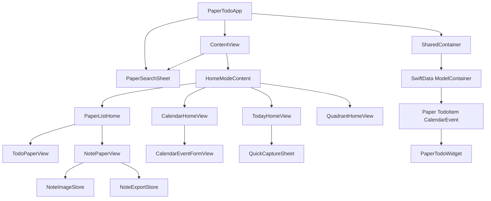

# 系统架构

## 应用结构

## 应用层

`PaperTodoApp` 创建 SwiftData 容器、注入 `AppSettings`，启动时初始化示例日历数据，并在后台清理孤立图片。`ContentView` 管理首页模式、纸片查询、筛选、导航、删除延迟和撤销状态。

## 展示层

- `HomeModeContent` 根据 `HomeMode` 切换今日、纸片、日历和四象限。
- `CalendarContextToolbar` 提供日历月份、选中日期、今天定位、月份切换和快速新增入口。
- `CalendarDisplayMode` 控制月视图和日程视图；iPhone 使用单列流，iPad 使用非重叠双列布局。
- `WeekCalendarCard` 展示选中日期所在周的七日事件列，复用日期选择、编辑和完成状态回调。
- `WeekAllDayStrip` 将全天事件和全天待办放在周视图小时网格上方，避免全天项进入具体时间排序。
- `TimelineEventRow` 根据选中日期生成单日或跨日时间摘要，并通过 `CalendarHomeView` 保存完成状态。
- `TodayHomeView` 聚合当天的未完成待办、已安排任务、日历事件、完成进度和计划容量。
- `TaskScheduleSheet` 编辑任务的计划开始时间、预计时长和全天状态，并保存派生结束时间。
- `QuickCaptureSheet` 将输入保存为收件箱任务或新笔记纸片。
- `PaperSearchSheet` 搜索纸片标题、Markdown 正文和待办内容，并支持直接打开结果。
- `DailyReviewSheet` 展示今日完成数、剩余数、排期时长和完成率。
- `TodoPaperView` 管理待办排序、完成、删除、拖放、撤销/重做、自动清除和 Widget 刷新。
- `PaperCard` 在纸片索引中展示待办进度、今日安排数量和下一项未完成任务。
- `NotePaperView` 管理 Markdown 编辑、预览、图片导入、导出和标题。
- `CalendarHomeView` 管理月份网格、日期选择、彩色事件标签、周标尺和日时间线。
- `CalendarDateSupport` 提供月份网格、周日期、小时槽和拖放载荷等纯日历支持类型，隔离日期计算与 SwiftUI 展示。
- `CalendarFilterState` 管理事件分类、待办来源、完成状态和全天状态筛选；`CalendarConflictSummary` 计算选中日期的时间重叠与计划容量提示。
- `NaturalLanguageScheduleParser` 将本地自然语言输入转换为可编辑的日程草稿，`NaturalLanguageScheduleSheet` 负责结构化确认并复用事件和待办保存路径。
- 日历页、今日页和待办纸片在排期保存成功后调用 `WidgetCenter.shared.reloadAllTimelines()`；今日排期筛选统一通过 `TodoItem.covers(_:calendar:)` 处理跨日和重复实例。
- `CalendarRecurrenceRule` 与模型 occurrence 查询负责生成指定日期范围内的每日或每周重复展示实例，并过滤例外日期。
- `QuadrantHomeView` 从 `TodoItem` 派生四象限任务并提供移动、编辑、完成和打开纸片。
- `SettingsView` 管理外观、配色、待办字号、自动清除和 Markdown 渲染强度。

## 数据和共享资源

`SharedContainer` 使用 App Group `group.com.papertodo` 保存 SwiftData store。`Paper` 通过级联关系拥有 `TodoItem`；`CalendarEvent` 独立保存事件。图片保存在 Documents 下的 `note-assets` 目录，`NoteImageStore` 负责合法文件名、缓存、导入、导出复制和引用清理。

## Widget

`PaperTodoWidget` 使用同一个 App Group 容器读取所有 `TodoItem`，生成待办数、完成数和进度。应用侧在关键待办变化后调用 `WidgetCenter.shared.reloadAllTimelines()`。

## 主要数据流

1. `PaperTodoApp` 创建并注入共享 ModelContainer。
2. `ContentView` 通过 `@Query` 读取纸片并按模式分发。
3. 子页面直接通过 `@Bindable` 修改模型，并使用 `modelContext.save()` 持久化。
4. Widget 通过相同 App Group store 读取待办汇总。
5. 图片正文引用经过 `NoteImageStore` 校验后进入 Documents 资源目录。
