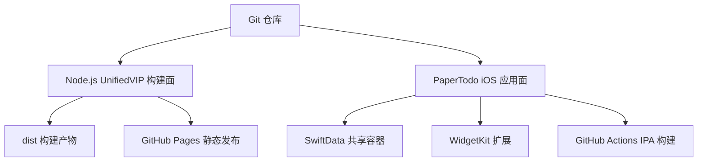
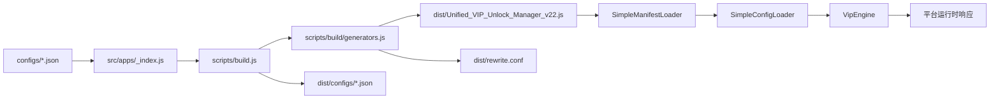
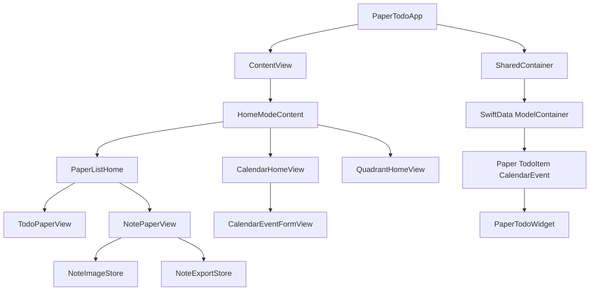

# 系统架构

## 仓库边界

## UnifiedVIP 架构

Node.js 部分采用“配置注册表 + 构建组装器 + 运行时引擎”的结构。

### 配置发现

`src/apps/_index.js` 扫描 `configs/` 下的 JSON 文件，读取每个配置的 `urlPattern` 并形成注册表。完整配置由 `getAllConfigs()` 返回，构建脚本将配置复制到 `dist/configs/` 并把清单、前缀索引和核心模块拼接到主脚本。

### 请求处理

生成的运行时先读取 `$request` 或 `$response` 的 URL，再由 `SimpleManifestLoader` 使用 URL 缓存、精确前缀、后缀、关键词和主机 token 缩小候选范围。匹配成功后，`SimpleConfigLoader` 从缓存或远程配置地址加载配置，`VipEngine` 根据模式修改响应、转发请求或返回远程内容。

### 平台适配

`src/core/platform.js` 通过 `$task`、`$httpClient`、`$loon` 和 `$stash` 判断 QX、Surge、Loon、Stash。`src/core/http.js` 将 GET/POST 封装为 Promise，并把平台回调、超时和响应状态归一化。

## PaperTodo iOS 架构

### 应用层

`PaperTodoApp` 创建 SwiftData 容器、注入 `AppSettings`，启动时初始化示例日历数据，并在后台清理孤立图片。`ContentView` 管理首页模式、纸片查询、筛选、导航、删除延迟和撤销状态。

### 展示层

- `HomeModeContent` 根据 `HomeMode` 切换纸片、日历和四象限。
- `TodoPaperView` 管理待办排序、完成、删除、拖放、撤销/重做和自动清除。
- `NotePaperView` 管理 Markdown 编辑、预览、图片导入、导出和标题。
- `CalendarHomeView` 管理月份网格、日期选择、事件时间线和事件表单入口。
- `QuadrantHomeView` 从 `TodoItem` 派生四象限任务并提供移动、编辑、完成和打开纸片。

### 数据和共享资源

`SharedContainer` 使用 App Group `group.com.papertodo` 保存 SwiftData store。`Paper` 通过级联关系拥有 `TodoItem`；`CalendarEvent` 独立保存事件。图片保存在 Documents 下的 `note-assets` 目录，`NoteImageStore` 负责合法文件名、缓存、导入、导出复制和引用清理。

### Widget

`PaperTodoWidget` 使用同一个 App Group 容器读取所有 `TodoItem`，生成待办数、完成数和进度。应用侧在关键待办变化后调用 `WidgetCenter.shared.reloadAllTimelines()`。
