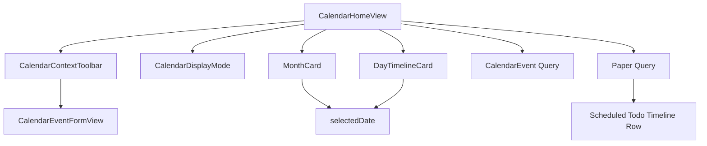

# Commercial Calendar Polish

Feature Name: calendar-commercial-polish
Updated: 2026-08-15

## Description

本方案将现有日历模式从装饰型双卡片布局整理为商业化日程工作台。日历工具栏承载全部一级操作，月视图负责规划，日程视图负责执行，iPad 使用稳定双列布局，iPhone 使用单列滚动布局。

## Architecture

`CalendarHomeView` 继续持有唯一的月份、选中日期和表单状态。`CalendarDisplayMode` 只控制内容层级，不改变持久化模型。工具栏通过绑定切换模式，月卡和时间线使用共享的选中日期。时间线从 `CalendarEvent` 和 `Paper.todoItems` 派生统一展示数据，待办完成继续复用 SwiftData 保存路径。

## Components And Interfaces

- `CalendarDisplayMode`: 定义 `month` 和 `agenda` 两种日历内容模式。
- `CalendarContextToolbar`: 增加视图选择器，保留今天、月份导航和新增入口。
- `CalendarHomeView`: 在窄屏使用纵向流，在宽屏使用非重叠双列；agenda 模式突出时间线。
- `MonthCard`: 保留紧凑事件色点和日期选择。
- `DayTimelineCard`: 作为月视图右侧或 agenda 模式主内容展示。
- `ScheduledTodoTimelineRow`: 展示已排期未完成待办，支持直接完成和上下文菜单操作。
- `TimelineStatusStrip`: 将日历事件和已排期待办纳入同一项数和完成进度。
- `TimelineNowMarker`: 在今天的执行时间线中标记当前时间。
- `CalendarEventFormView`: 使用完整日期时间比较进行跨日校验。

## Data Models

继续使用现有 `CalendarEvent` 和 `TodoItem` 排期字段。本轮通过视图层派生统一时间线，不新增 SwiftData 字段。

## Correctness Properties

- 视图切换不会改变 `month` 或 `selectedDate`。
- 宽屏月卡和时间线的布局边界不发生重叠。
- 完整结束日期时间晚于完整开始日期时间时，表单保存校验为真。
- 事件完成状态、编辑和新增继续使用现有 SwiftData 保存路径。
- 选中日期的未完成排期待办与日历事件同时进入时间线统计。
- 已排期待办按完整排期日期区间覆盖月视图、周视图和日程视图。
- 已完成排期待办保留在日历历史中，并参与完成统计。
- 今天的时间线包含当前时间标记，其他日期展示静态安排时间线。
- 待办完成保存失败时回滚待办状态并显示错误提示。

## Error Handling

- 日期计算失败时沿用当前有效日期作为回退。
- 保存失败时保留日历当前视图和表单输入，并显示错误提示。

## Test Strategy

- 通过 GitHub Actions `PaperTodo iOS Build` 验证 XcodeGen、无签名构建和 IPA 打包。
- 检查月视图与日程视图切换后日期状态保持。
- 在 iPhone 和 iPad 宽度检查工具栏、月卡和时间线无重叠。
- 检查跨日事件新增和编辑的日期时间校验。
- 检查排期待办显示、直接完成、保存失败回滚和统一进度统计。
- 检查跨日排期待办在月视图、周视图和日程视图中的覆盖范围。
- 检查今天的当前时间标记和已完成排期待办的历史展示。

## References

- [Apple iPhone User Guide: Change how you view events in Calendar](https://support.apple.com/en-gb/guide/iphone/iphfd1054569/ios)
- [Apple iPhone User Guide: Create and edit events in Calendar](https://support.apple.com/en-gb/guide/iphone/iph3d110f84/ios)
- `PaperTodo-iOS/PaperTodo/Views/CalendarHomeView.swift`
- `PaperTodo-iOS/PaperTodo/Views/CalendarEventFormView.swift`
