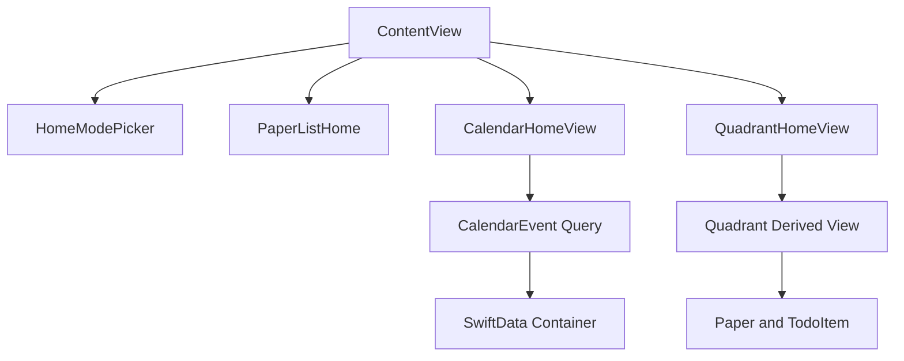

# Calendar And Quadrant Home

Feature Name: calendar-quadrant-home
Updated: 2026-08-14

## Description

在现有 PaperTodo 首页增加三种模式：纸片列表、日历视图、四象限视图。日历视图使用月历网格和层叠日时间线承载时间安排，四象限视图承载优先级整理。日程数据使用 `CalendarEvent` 持久化，继续复用现有 SwiftData 容器和 App Group。

## Architecture

`ContentView` 负责模式状态和导航，子视图负责单一展示场景。现有模型继续作为数据源；缺少日期或象限字段时使用确定性派生规则，保证旧数据立即可展示。

## Components And Interfaces

- `HomeMode`: 首页模式枚举，包含 `list`、`calendar`、`quadrant`。
- `HomeModePicker`: 首页顶部的分段模式切换控件。
- `CalendarHomeView`: 月份导航、日期网格、选中日期任务列表。
- `MonthCard`: 参考图风格月视图卡片和多色事件标签。白色 0.88 半透明 + `.ultraThinMaterial`，24pt 圆角，宽约 55% 屏宽；日期单元格容纳最多 3 行 9pt 彩色标签和 `+N` 溢出提示，选中日期 34×34 主色圆形高亮。
- `DayTimelineCard`: 参考图风格日时间线卡片、周标尺和事件卡片。`.thinMaterial`，左上/左下 28pt、右上/右下 24pt 圆角，宽约 60% 屏宽并向右偏移约 40% 覆盖月卡；时间刻度 44pt 右对齐，左侧分类色圆环与贯穿轴线，右侧白色圆角 16pt 事件卡片。
- `CalendarEventFormView`: 新建/编辑日程的表单，支持标题、日期、开始/结束时间、分类、完成状态和备注，编辑模式可删除日程。
- `CalendarTabBar`: 日历识图模式底部导航栏，70pt 高，选中项 52×52 主色圆形 scale 动画并轻微上浮。
- `CalendarBackdrop`: 浅蓝灰渐变背景、40pt 间距淡网格纹理，以及带独立相位浮动动画的 Google G、Excel E、Outlook 信封三个装饰图标。
- `QuadrantHomeView`: 四象限网格和任务卡片。
- `QuadrantTask`: 从待办项目派生的象限任务。

## Data Models

`CalendarEvent` 保存标题、开始时间、结束时间、分类、完成状态和备注。`EventCategory` 提供 8 种分类的标签背景、标签文字和圆环颜色，色值严格对照参考图。现有 `Paper` 和 `TodoItem` 保持兼容。四象限分类使用确定性规则：未完成任务按文本标签和任务状态推导默认象限；后续可将象限属性持久化到 `TodoItem`。

首次启动时 `SharedContainer.seedCalendarEvents` 在共享容器为空时写入 9 条示例日程（晨跑、种花、回邮件、沟通方案、超市购物、写日记、短视频拍摄、订机票、拿快递），分类选择保证标签与圆环颜色符合参考图规范。

## Correctness Properties

- 每个可见待办最多出现在一个日历日期和一个四象限区域。
- 月历网格始终包含完整的周行，日期顺序按系统日历排序。
- 四象限区域的标题、颜色和优先级语义保持固定映射。
- 视图切换不会修改 `Paper` 或 `TodoItem` 内容。

## Error Handling

- 无任务日期显示空状态和新增入口。
- 无待办四象限显示空状态。
- 任务打开失败时保留当前视图，并通过现有导航路径处理可用的 `Paper`。

## Test Strategy

- 单元测试日期网格跨月、月初星期偏移和空月份状态。
- 单元测试四象限默认分类和任务完成状态。
- UI 测试首页三种模式切换、月份切换、任务打开和象限显示。
- 页面加载时两张卡片从下方 40pt 滑入（spring 0.6s）。
- 日期切换时周标尺选中圆从 0.5 缩放到 1.0（spring 0.35s）。
- 事件卡片按下缩放 0.96、背景切换为 #F5F5F7，松手弹回，点击打开事件编辑表单。
- Tab 切换时选中圆形从 scale 0 放大到 1 并上浮 2pt。
- 装饰图标持续上下浮动，各图标相位差 0.5s。
- 在 iPhone 和 iPad 尺寸下验证网格不重叠、标题不截断和按钮可触达。
