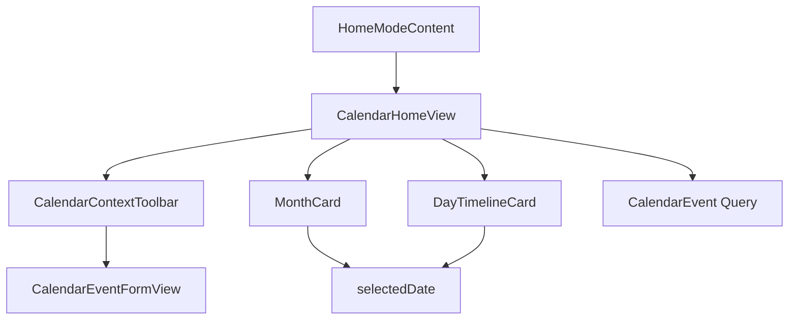

# Calendar Top And View Optimization

Feature Name: calendar-top-view-optimization
Updated: 2026-08-15

## Description

优化日历模式的顶部导航和月历浏览路径。顶部提供稳定的日历上下文、今天定位、月份切换和快速新增；月历与日时间线继续共享同一个 `month` 和 `selectedDate` 状态。

## Architecture

`CalendarHomeView` 继续管理月份、选中日期和日程表单。`CalendarContextToolbar` 只负责展示上下文和触发导航回调；`MonthCard` 保留日期网格，月内省略号菜单由直接可见的月份箭头和今天按钮替代。

## Components And Interfaces

- `CalendarContextToolbar`: 展示“日历”、当前月份、选中日期摘要、事件数量、今天按钮、前后月份按钮和新增按钮。
- `CalendarHomeView`: 新增 `CalendarContextToolbar`，向工具栏传递 `shiftMonth`, `addEvent` 和 `selectedDate` 相关状态。
- `MonthCard`: 保留网格和日期事件标签，移除重复的月份菜单入口，减少卡片头部操作密度。
- `DayTimelineCard`: 保留周标尺和事件列表；标题区域继续显示选中日期和新增入口，形成顶部工具栏与内容卡片的双层层级。

## Data Models

继续使用 `CalendarEvent`，本轮不新增持久化字段。`month` 和 `selectedDate` 为视图状态，月份导航沿用现有 `shiftMonth` 逻辑。

## Correctness Properties

- 今天按钮始终将 `month` 和 `selectedDate` 设置为当前日期。
- 月份前后按钮始终将 `month` 移动一个自然月，并将 `selectedDate` 设为目标月份第一天。
- 工具栏显示的事件数量与 `selectedEvents.count` 一致。
- 工具栏新增入口使用当前 `selectedDate` 打开事件表单。

## Error Handling

- 日历日期计算失败时继续使用当前有效日期作为回退值。
- 日程保存失败时沿用现有错误提示并保留日历视图状态。

## Test Strategy

- 通过 GitHub Actions `PaperTodo iOS Build` 验证 Swift 编译、项目生成和 IPA 打包。
- 使用现有日历行为检查月份切换、今天定位、日期选择和表单打开路径。
- 在 iPhone 和 iPad 宽度下检查工具栏控件触达区域、标题截断和月历/时间线布局。

## References

- [Apple iPhone User Guide: Change how you view events](https://support.apple.com/guide/iphone/change-how-you-view-events-iphfd1054569/ios)
- [Apple iPhone User Guide: Create and edit events in Calendar](https://support.apple.com/guide/iphone/create-and-edit-events-in-calendar-iph3d110f84/ios)
- `PaperTodo-iOS/PaperTodo/Views/CalendarHomeView.swift`
- `PaperTodo-iOS/PaperTodo/Views/HomeModeContent.swift`
