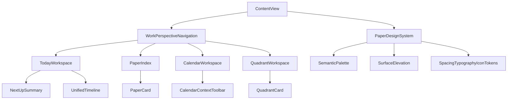

# PaperTodo Commercial UI Upgrade

Feature Name: papertodo-commercial-ui-upgrade
Updated: 2026-08-15

## Description

本设计将 PaperTodo 定义为 Editorial Paper OS：保留纸片作为品牌资产，引入现代 iOS 工作台的信息层级、低饱和语义色彩、克制材质和任务执行动效。实现层继续使用 SwiftUI、SwiftData、SF Symbols 和现有状态模型，优先改造 View 层和 DesignSystem，保证业务持久化与 Widget 行为稳定。

## Architecture

`ContentView` 继续负责应用级导航、查询、删除撤销和 Sheet 状态。`HomeModeContent` 提供自适应的工作视角导航。`DesignSystem.swift` 和 `PaperTheme.swift` 提供跨页面共享的语义 token、表面样式和交互反馈。Today、Paper、Calendar、Quadrant 和 detail views 只组合共享组件，并保留现有 SwiftData 保存路径。

## Design Decisions

### 1. 品牌视觉

- 主方向：Warm Graphite + Oxide Copper。
- 画布与纸张使用低对比暖中性层。
- 品牌主操作使用铜色，日历时间使用蓝灰色，完成状态使用绿色，警告使用砖红色。
- 主题切换改变纸张氛围，语义操作颜色保持稳定。
- 使用平面、raised、floating 三级表面，减少全页面卡片和阴影堆叠。

### 2. 首页层级

- Today 是默认主工作台。
- 首页从上到下展示日期上下文、完成摘要、Next Up、统一时间轴、未安排任务和快速记录。
- 添加任务、今日回顾和筛选进入次级操作区。
- iPhone 使用底部工作视角导航；iPad 使用自适应侧栏或持久导航区域。

### 3. 组件策略

- 继续使用 SF Symbols，统一图标尺寸和交互区域。
- 抽取语义组件，避免页面直接使用 raw Color、shadow、cornerRadius 和任意间距。
- 所有可交互图标控件保持最小 44pt 触控区域。
- 所有组件同时提供 Light、Dark、Dynamic Type、VoiceOver 和 Reduce Motion 语义。

## Components And Interfaces

### Design System

- `PaperSpacing`：4pt 基础间距和 8pt 节奏层级。
- `PaperRadius`：control、block、shell 三档圆角。
- `PaperElevation`：flat、raised、floating 三档表面层级。
- `PaperTypography`：标题、模块、正文、辅助文本和等宽数字样式。
- `PaperIconSize`：small、medium、large 三档 SF Symbols 尺寸。
- `PaperSurface`：统一画布、纸张和 raised surface 的背景与边界。
- `PaperPrimaryButton`、`PaperSecondaryButton`、`PaperIconButton`：统一操作状态和无障碍语义。
- `PaperFilterChip`、`PaperWorkPerspectiveNavigation`：统一筛选和一级视角切换。

### Today Workspace

- `TodayWorkspaceHeader`：日期、剩余任务和完成状态。
- `TodayProgressSummary`：完成数、已安排时长和未安排数量。
- `NextUpCard`：下一项可执行任务或开始规划入口。
- `UnifiedTimeline`：日历事件和排期待办的统一时间线。
- `QuickCaptureAction`：复用现有快速记录 Sheet。

### Paper And Priority Views

- `PaperCard`：类型、进度、下一项任务、置顶和排期上下文。
- `PaperIndexHeader`：标题、搜索、新建和筛选。
- `QuadrantCard`：象限说明、数量、任务列表和新增入口。
- `TodoTaskRow`：完成、文本、排期、来源和菜单操作。
- `NoteEditorHeader`：标题、编辑/预览、保存状态和文档操作。

### Calendar Views

- `CalendarContextToolbar`：月份、选中日期、视图、筛选、导航和新增。
- `MonthCalendarSurface`：稳定日期单元格高度、密度点和选中态。
- `WeekPlanningSurface`：周容量、排期、冲突和空闲时段。
- `AgendaExecutionSurface`：当天执行时间线、当前时间和完成进度。

## Data Models

本轮不新增 SwiftData 字段。继续使用现有 `Paper`、`TodoItem`、`CalendarEvent`、`AppSettings`、`PaperPalette` 和 `HomeMode`。UI 层从现有查询与派生属性生成展示状态；保存、删除、撤销、Widget 刷新、日历跨日覆盖和 Markdown 图片资源边界继续复用当前实现。

## Correctness Properties

- 所有页面的语义颜色、间距、圆角、表面和文字层级来自共享 token。
- 视角切换保持对应的选中日期、筛选条件和导航状态。
- Today 的任务、日历事件、完成状态和排期统计继续与 SwiftData 数据一致。
- 纸片卡片展示的进度与 `TodoItem.isDone` 状态一致。
- 日历的事件分类、完成状态、冲突状态和时间上下文保持可区分。
- Dynamic Type 不造成关键操作遮挡、截断或重叠。
- VoiceOver 顺序与视觉层级一致，装饰图标不进入朗读内容。
- Reduce Motion 下状态反馈仍然可感知。

## Error Handling

- UI 样式改造沿用现有保存失败、删除确认、撤销和恢复路径。
- 任何新增的视觉状态组件必须为保存失败、空数据、加载中和无权限等状态提供可读文本或可访问标签。
- 动画状态在任务取消、页面离开和数据更新时保持可中断。
- 视觉升级不改变错误信息、数据回滚和用户输入保留逻辑。

## Test Strategy

- 先完成视觉组件和页面实现，再补充针对 token、状态、布局和交互的测试任务。
- 使用 GitHub Actions `PaperTodo iOS Build` 验证 XcodeGen、无签名构建和 Release 构建。
- 检查代表性 iPhone/iPad 尺寸下的导航、列表、日历、象限和详情页布局。
- 检查 Light/Dark、四种主题、动态字体、VoiceOver、Reduce Motion、空数据和长文本。
- 对任务完成、快速记录、日程查看、纸片导航和删除撤销执行回归验证。

## Implementation Boundaries

- 本阶段优先修改 `Support/DesignSystem.swift`、`Support/PaperTheme.swift` 和 `Views/`。
- 本阶段保持 SwiftData 模型、服务层、Widget 数据接口和持久化字段稳定。
- 本阶段先完成 P0 视觉基础与 Today 工作台，再推进 P1 纸片/日历/四象限，最后推进 P2/P3 细节和质量基线。

## References

- `PaperTodo-iOS/PaperTodo/ContentView.swift`
- `PaperTodo-iOS/PaperTodo/Views/HomeModeContent.swift`
- `PaperTodo-iOS/PaperTodo/Views/TodayHomeView.swift`
- `PaperTodo-iOS/PaperTodo/Views/CalendarHomeView.swift`
- `PaperTodo-iOS/PaperTodo/Views/QuadrantHomeView.swift`
- `PaperTodo-iOS/PaperTodo/Support/DesignSystem.swift`
- `PaperTodo-iOS/PaperTodo/Support/PaperTheme.swift`
- `.monkeycode/docs/模块/PaperTodo-iOS.md`
- `.monkeycode/specs/calendar-commercial-polish/design.md`
